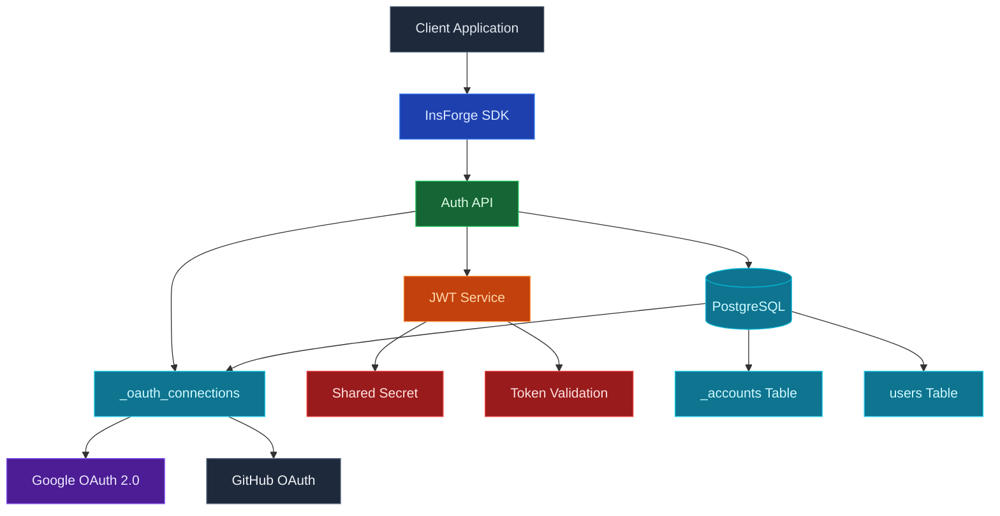
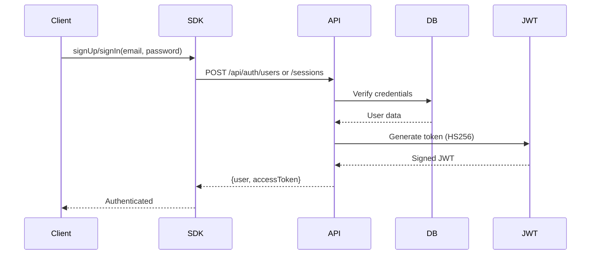
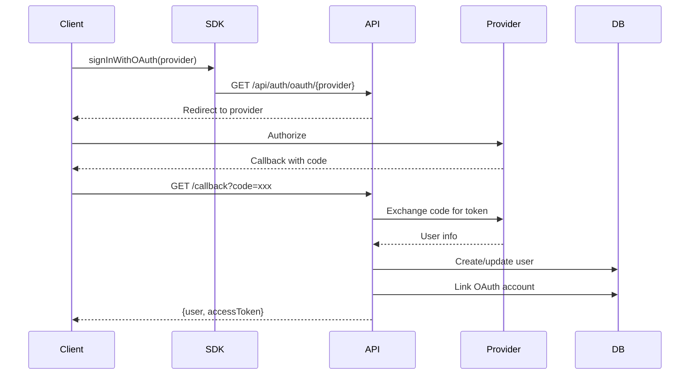

## Overview

InsForge implements a modern, secure authentication system using JWT tokens with RSA signing, OAuth provider integration, and database-backed session management.

## Technology Stack



## Core Components

| Component | Technology | Purpose |
|-----------|------------|---------|
| **Token Format** | JWT with HS256 | Stateless authentication tokens |
| **Signing Algorithm** | HMAC-SHA256 | Symmetric key signing with shared secret |
| **Authentication** | Stateless JWT | No server-side session storage |
| **Password Hashing** | bcryptjs (10 rounds) | Secure password storage |
| **OAuth Providers** | Google, GitHub | Social authentication |
| **Token Expiry** | Fixed | 7 days for user tokens, never for anon tokens |

## Authentication Flow

### Password-Based Authentication



### OAuth Flow



## JWT Token Structure

### Token Payload

```json
{
  "sub": "user_id_uuid",
  "email": "user@example.com",
  "role": "authenticated",
  "iat": 1704067200,
  "exp": 1704672000,
  "iss": "insforge",
  "aud": "insforge-api"
}
```

### Token Claims

| Claim | Description | Example |
|-------|-------------|---------|
| `sub` | Subject (User ID) | UUID format |
| `email` | User's email | user@example.com |
| `role` | User role/permissions | authenticated, admin |
| `iat` | Issued at timestamp | Unix timestamp |
| `exp` | Expiration timestamp | Unix timestamp |
| `iss` | Token issuer | insforge |
| `aud` | Intended audience | insforge-api |

## Security Features

<CardGroup cols={2}>
  <Card title="HS256 Signing" icon="signature">
    Tokens signed with HMAC-SHA256 using shared secret key
  </Card>
  
  <Card title="bcrypt Hashing" icon="lock">
    Passwords hashed with bcryptjs using 10 salt rounds
  </Card>
  
  <Card title="OAuth State" icon="shield-check">
    CSRF protection via state parameter in OAuth flows
  </Card>
  
  <Card title="Stateless Auth" icon="clock">
    JWT tokens with built-in expiry, no server-side sessions
  </Card>
  
  <Card title="Token Rotation" icon="arrows-rotate">
    Support for refresh token rotation (coming soon)
  </Card>
  
  <Card title="Rate Limiting" icon="gauge">
    Protection against brute force attacks
  </Card>
</CardGroup>

## API Endpoints

### Authentication Endpoints

| Method | Endpoint | Purpose |
|--------|----------|---------|
| POST | `/api/auth/users` | Register new user |
| POST | `/api/auth/sessions` | Login with email/password |
| GET | `/api/auth/sessions/current` | Get current user (requires auth) |
| POST | `/api/auth/admin/sessions` | Admin login (local development) |
| POST | `/api/auth/admin/sessions/exchange` | Exchange authorization code (cloud platform) |

### OAuth Endpoints

| Method | Endpoint | Purpose |
|--------|----------|---------|
| GET | `/api/auth/oauth/google` | Initiate Google OAuth flow |
| GET | `/api/auth/oauth/github` | Initiate GitHub OAuth flow |
| GET | `/api/auth/oauth/:provider/callback` | OAuth callback handler |

### Admin Endpoints

| Method | Endpoint | Purpose |
|--------|----------|---------|
| GET | `/api/auth/users` | List all users (admin only) |
| DELETE | `/api/auth/users` | Delete users (admin only) |

## OAuth Provider Configuration

### Google OAuth 2.0

- **Authorization URL**: `https://accounts.google.com/o/oauth2/v2/auth`
- **Token URL**: `https://oauth2.googleapis.com/token`
- **Scopes**: `openid`, `email`, `profile`
- **Required**: Client ID, Client Secret, Redirect URI

### GitHub OAuth

- **Authorization URL**: `https://github.com/login/oauth/authorize`
- **Token URL**: `https://github.com/login/oauth/access_token`
- **Scopes**: `read:user`, `user:email`
- **Required**: Client ID, Client Secret, Redirect URI

## Token Validation

### Validation Steps

1. **Format Check**: Verify JWT structure (header.payload.signature)
2. **Signature Verification**: Validate with RSA public key
3. **Expiry Check**: Ensure token hasn't expired
4. **Issuer/Audience**: Verify iss and aud claims
5. **User Lookup**: Check user exists in _accounts table
6. **User Status**: Ensure user account is active

### Middleware Flow

```javascript
// Simplified validation flow (stateless)
async function validateToken(token) {
  // 1. Decode and verify JWT
  const decoded = jwt.verify(token, publicKey, {
    algorithms: ['RS256'],
    issuer: 'insforge',
    audience: 'insforge-api'
  });
  
  // 2. Check user exists (optional)
  const user = await db.query(
    'SELECT * FROM _accounts WHERE id = $1',
    [decoded.sub]
  );
  
  // 3. Return user context from JWT
  return {
    userId: decoded.sub,
    email: decoded.email,
    role: decoded.role
  };
}
```

## Security Best Practices

<CardGroup cols={2}>
  <Card title="HTTPS Only" icon="lock">
    Always use HTTPS in production to protect tokens in transit
  </Card>
  
  <Card title="Secure Storage" icon="database">
    Store tokens in httpOnly cookies or secure storage
  </Card>
  
  <Card title="Short Expiry" icon="clock">
    Use short-lived access tokens with refresh tokens
  </Card>
  
  <Card title="Revocation" icon="ban">
    Implement token revocation for compromised accounts
  </Card>
  
  <Card title="Password Policy" icon="key">
    Enforce strong password requirements
  </Card>
  
  <Card title="2FA Support" icon="mobile">
    Two-factor authentication (coming soon)
  </Card>
</CardGroup>

## Environment Variables

| Variable | Description | Example |
|----------|-------------|---------|
| `JWT_SECRET` | RSA private key or secret | Base64 encoded key |
| `GOOGLE_CLIENT_ID` | Google OAuth client ID | xxx.apps.googleusercontent.com |
| `GOOGLE_CLIENT_SECRET` | Google OAuth secret | Secret string |
| `GITHUB_CLIENT_ID` | GitHub OAuth client ID | GitHub app ID |
| `GITHUB_CLIENT_SECRET` | GitHub OAuth secret | Secret string |
| `TOKEN_EXPIRY` | Token lifetime | 7d, 24h, 3600 |

