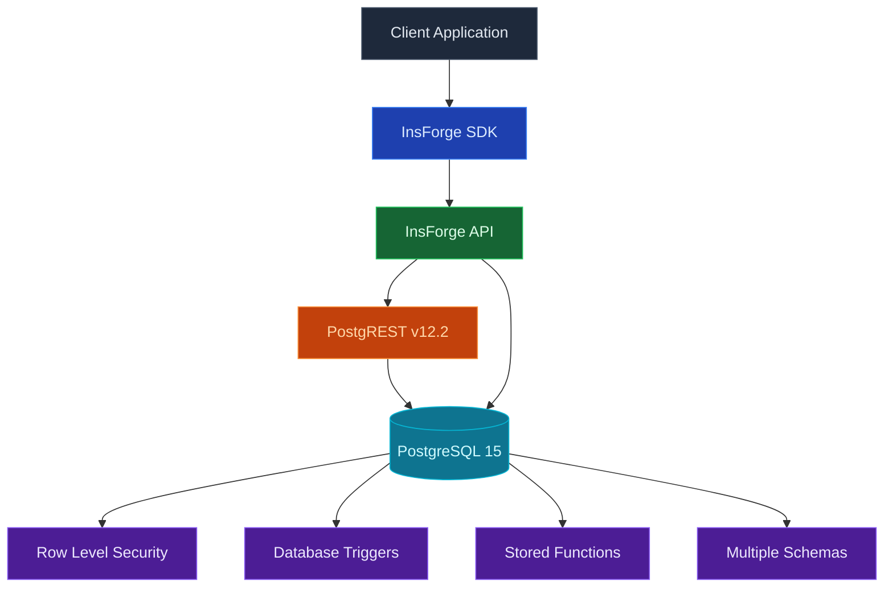

## Overview

InsForge uses a powerful database stack that automatically generates REST APIs from your PostgreSQL schema, eliminating the need to write backend CRUD code.

## Technology Stack



## Core Components

| Component | Technology | Version | Purpose |
|-----------|------------|---------|---------|
| **Database** | PostgreSQL | 15.13 | ACID-compliant relational database |
| **REST API** | PostgREST | 12.2.12 | Auto-generates RESTful APIs from public schema only |
| **Query Engine** | PostgREST DSL | - | Powerful filtering with operators and functions |
| **Security** | Row Level Security | - | Fine-grained access control at the row level |
| **Roles** | PostgreSQL Roles | - | anon (read-only), authenticated (CRUD), project_admin (full) |
| **SDK** | @insforge/sdk | Latest | Type-safe JavaScript/TypeScript client |

## How It Works

### 1. Schema Definition
When you create a table through the InsForge API or migrations:
- Table structure is stored in PostgreSQL
- PostgREST discovers the schema via database introspection
- REST endpoints are instantly available

### 2. API Generation
PostgREST automatically creates endpoints:
- `GET /api/database/records/{table}` - Query records
- `POST /api/database/records/{table}` - Insert records  
- `PATCH /api/database/records/{table}` - Update records
- `DELETE /api/database/records/{table}` - Delete records

### 3. Query Translation
HTTP requests are converted to optimized SQL:
```
GET /api/database/records/products?price=gte.100&category=eq.electronics
↓
SELECT * FROM products 
WHERE price >= 100 
AND category = 'electronics'
```

### 4. Security Layer
- JWT tokens are validated on each request
- User ID extracted from token
- RLS policies applied based on user context
- Only authorized rows are returned

### 5. Response Format
- Results returned as JSON arrays
- HTTP status codes indicate success/failure
- Headers include pagination info

## PostgREST Features

<CardGroup cols={2}>
  <Card title="Instant APIs" icon="bolt">
    Every table gets full CRUD endpoints automatically without writing any backend code
  </Card>
  
  <Card title="Advanced Filtering" icon="filter">
    Complex queries with operators like `eq`, `gt`, `like`, `in`, `is`, `or`
  </Card>
  
  <Card title="Relationship Embedding" icon="link">
    Join related tables in single requests using foreign key relationships
  </Card>
  
  <Card title="Bulk Operations" icon="layer-group">
    Insert, update, or delete multiple records in a single atomic transaction
  </Card>
  
  <Card title="Computed Fields" icon="calculator">
    Expose database functions and views as API endpoints
  </Card>
  
  <Card title="Real-time Updates" icon="sync">
    NOTIFY/LISTEN for schema changes without restart
  </Card>
</CardGroup>

## Database Structure

InsForge uses two PostgreSQL databases:

### Main Database (`insforge`)
All application and system tables reside in the `public` schema:

| Table Type | Purpose | Examples |
|------------|---------|----------|
| **User Tables** | Created by developers | Any table you create |
| **System Tables** | Internal InsForge tables | Prefixed with `_` |

### Analytics Database (`_insforge`)
Separate database for analytics with `_analytics` schema for Logflare integration.

### System Tables (in `public` schema)

| Table | Purpose |
|-------|---------|
| `_accounts` | Core user authentication records |
| `users` | User profile data (references _accounts) |
| `_oauth_connections` | OAuth provider connections |
| `_storage_buckets` | Storage bucket configuration |
| `_storage` | File metadata and references |
| `_ai_configs` | AI model configurations per project |
| `_ai_usage` | AI token usage tracking |
| `_config` | System configuration key-value store |
| `_metadata` | Application metadata |
| `_mcp_usage` | MCP tool usage tracking |
| `_edge_functions` | Edge function definitions |
| `logs` | Activity and audit logs |

## Query Syntax

PostgREST provides a powerful query syntax that maps to SQL:

### Operators

| Operator | SQL Equivalent | Example |
|----------|---------------|---------|
| `eq` | `=` | `?id=eq.123` |
| `neq` | `!=` | `?status=neq.deleted` |
| `gt` | `>` | `?age=gt.18` |
| `gte` | `>=` | `?price=gte.100` |
| `lt` | `<` | `?created=lt.2024-01-01` |
| `lte` | `<=` | `?quantity=lte.10` |
| `like` | `LIKE` | `?name=like.*john*` |
| `ilike` | `ILIKE` | `?email=ilike.*gmail*` |
| `in` | `IN` | `?status=in.(active,pending)` |
| `is` | `IS` | `?deleted_at=is.null` |

### Complex Queries

```javascript
// Combine conditions with AND
GET /api/database/records/products?price=gte.100&category=eq.electronics

// OR conditions
GET /api/database/records/products?or=(price.lt.50,on_sale.is.true)

// Nested conditions
GET /api/database/records/orders?and=(status.eq.pending,or=(priority.eq.high,created_at.lt.2024-01-01))
```

## Performance Optimizations

### Connection Pooling
- PgBouncer manages database connections
- Reduces connection overhead
- Handles concurrent requests efficiently

### Query Optimization
- PostgREST generates optimized SQL
- Uses prepared statements
- Leverages PostgreSQL query planner

### Indexing Strategy
- Automatic indexes on primary keys
- Foreign key indexes for joins
- Custom indexes via migrations

### Caching
- ETags for conditional requests
- Client-side caching support
- Response compression

## Data Types

PostgreSQL types are automatically mapped to JSON:

| InsForge Type | PostgreSQL Type | JSON Type | Notes |
|---------------|----------------|-----------|-------|
| `string` | `TEXT` | string | Text of any length |
| `integer` | `INTEGER` | number | 32-bit integers |
| `float` | `DOUBLE PRECISION` | number | Decimal numbers |
| `boolean` | `BOOLEAN` | boolean | true/false |
| `date` | `DATE` | string | ISO 8601 date format |
| `datetime` | `TIMESTAMPTZ` | string | ISO 8601 with timezone |
| `uuid` | `UUID` | string | Auto-generated unique identifier |
| `json` | `JSONB` | object/array | Structured JSON data with indexing |

## Best Practices

<CardGroup cols={2}>
  <Card title="Use Indexes" icon="gauge">
    Create indexes on frequently queried columns
  </Card>
  
  <Card title="Leverage RLS" icon="shield">
    Implement Row Level Security for data isolation
  </Card>
  
  <Card title="Batch Operations" icon="boxes">
    Use bulk inserts/updates for better performance
  </Card>
  
  <Card title="Select Columns" icon="table-columns">
    Query only needed columns to reduce payload
  </Card>
  
  <Card title="Use Views" icon="eye">
    Create views for complex queries
  </Card>
  
  <Card title="Monitor Performance" icon="chart-line">
    Use EXPLAIN ANALYZE for slow queries
  </Card>
</CardGroup>

## Limitations

- **No Custom Business Logic**: PostgREST handles CRUD only
- **SQL Knowledge Helpful**: Complex queries benefit from SQL understanding
- **Schema Changes**: Require PostgREST reload (automatic via NOTIFY)
- **File Handling**: Use storage API for files, not database

## Comparison with Traditional APIs

| Aspect | Traditional REST API | InsForge + PostgREST |
|--------|---------------------|----------------------|
| **Development Time** | Write CRUD for each table | Instant APIs from schema |
| **Maintenance** | Update code for schema changes | Automatic updates |
| **Performance** | Depends on implementation | Optimized SQL generation |
| **Consistency** | Varies by developer | Uniform API patterns |
| **Documentation** | Manual updates needed | Auto-generated OpenAPI |
| **Security** | Custom implementation | Built-in RLS + JWT |