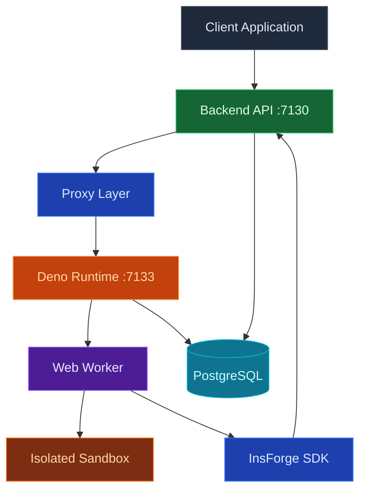
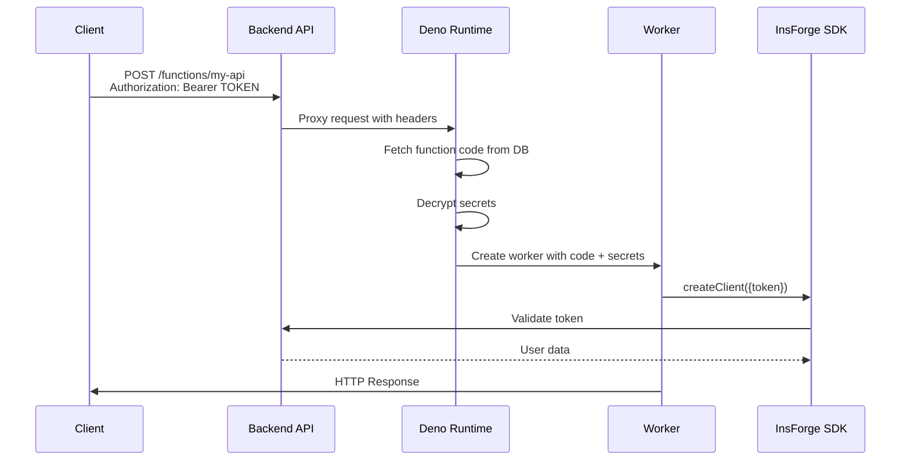

## Overview

InsForge Functions provide a secure, scalable serverless compute platform that runs JavaScript/TypeScript code in isolated Deno workers with full access to the InsForge SDK.

## Technology Stack

## Core Components

| Component | Technology | Port | Purpose |
|-----------|------------|------|---------|
| **Backend API** | Node.js/Express | 7130 | Function management, authentication, proxy |
| **Runtime** | Deno v2.0.6 | 7133 | Secure JavaScript/TypeScript execution |
| **Sandbox** | Web Workers | - | Isolated execution environment |
| **Database** | PostgreSQL | 5432 | Function code and metadata storage |
| **SDK** | @insforge/sdk | - | Pre-injected client for backend access |
| **Secrets** | AES-256-GCM | - | Encrypted environment variables |

## How It Works

When a client makes a request to `/functions/{slug}`:

1. The backend API receives and validates the request
2. Request is proxied to the Deno runtime
3. Function code is executed in an isolated Web Worker
4. The function has access to the InsForge SDK and environment variables
5. Response is returned to the client

### Authentication Flow

## Performance Characteristics

### Execution Limits

| Limit | Value | Description |
|-------|-------|-------------|
| **Timeout** | 30 seconds | Maximum execution time per invocation |
| **Memory** | Worker default | Depends on Deno worker allocation |
| **Payload Size** | 10MB | Maximum request/response size |
| **Concurrent Workers** | System dependent | Limited by server resources |
| **Cold Start** | ~50-200ms | Time to create new worker |

### Optimization Strategies

1. **Worker Pooling**: Workers are created on-demand
2. **Code Caching**: Function code cached in memory
3. **Secret Caching**: Decrypted secrets cached per execution
4. **SDK Reuse**: SDK client created once per worker

## Best Practices

1. **Keep Functions Small**: Single responsibility per function
2. **Handle Errors Gracefully**: Always return proper HTTP responses
3. **Validate Input**: Check request data before processing
4. **Use Caching**: Cache frequently accessed data
5. **Optimize Queries**: Use efficient database queries
6. **Monitor Performance**: Track execution times and errors
7. **Secure Secrets**: Never log sensitive data
8. **Test Locally**: Test functions before deployment
