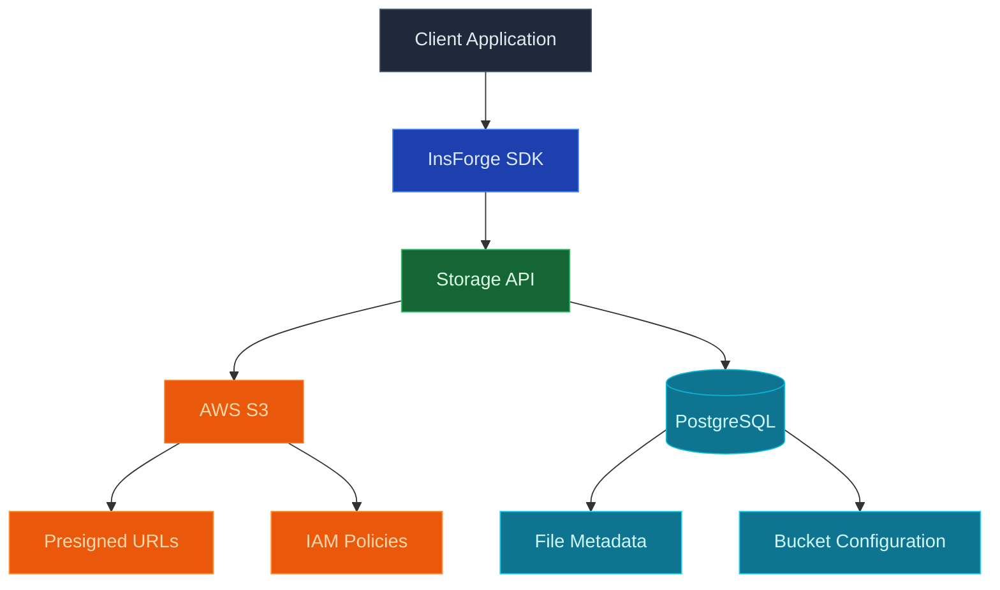
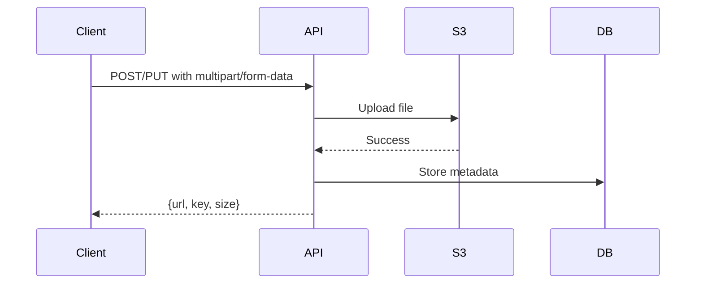
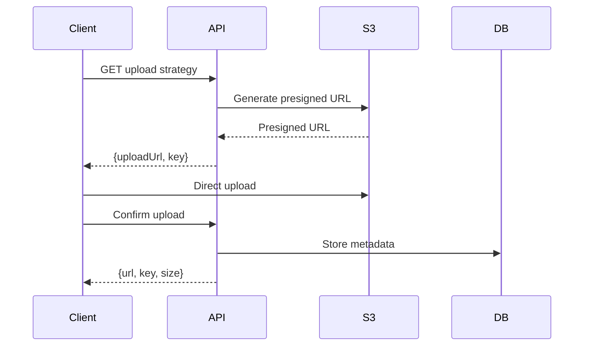

## Overview

InsForge provides a high-performance, scalable storage system built on AWS S3, delivering enterprise-grade reliability with 99.999999999% (11 9's) durability.

## Technology Stack



## Core Components

| Component | Technology | Purpose |
|-----------|------------|---------|
| **Storage Backend** | AWS S3 | Enterprise-grade object storage |
| **Metadata Store** | PostgreSQL | File metadata, bucket configuration |
| **Upload Handler** | Multer | Multipart form data parsing (both backends) |
| **URL Strategy** | Presigned URLs | Secure direct uploads/downloads (S3 only) |
| **Access Control** | JWT + Bucket visibility | Public/private bucket permissions |

## AWS S3 Architecture

### Enterprise Features

- **Direct Uploads**: Presigned URLs bypass API server for unlimited scale
- **IAM Security**: Role-based authentication without credential management
- **Multi-Tenancy**: Secure isolation between projects using app key prefix
- **Bucket Policies**: Public and private bucket configurations
- **Automatic Cleanup**: Configurable lifecycle policies
- **Metadata Tracking**: Rich file metadata stored in PostgreSQL

## Upload Strategies

### Direct Upload to S3



### Presigned URL Upload (Recommended)



## Bucket Configuration

### Bucket Types

| Type | Access | Use Case |
|------|--------|----------|
| **Public** | No auth required for downloads | Public assets, images, static files |
| **Private** | Auth required for all operations | User files, sensitive documents |


## File Operations

### Upload Flow

1. **Request Upload**: Client requests upload permission
2. **Validation**: Check auth, bucket permissions, file size
3. **Strategy Selection**: Choose direct or presigned upload
4. **Upload**: Client uploads via selected method
5. **Confirmation**: Verify upload and store metadata
6. **Response**: Return file URL and metadata

### Download Flow

1. **Request File**: Client requests file access
2. **Permission Check**: Verify bucket/object permissions
3. **Strategy Selection**: Direct serve or presigned URL
4. **Delivery**: Stream file or redirect to URL

## Security Features

<CardGroup cols={2}>
  <Card title="Bucket Policies" icon="shield">
    Public, private, or protected bucket access control
  </Card>
  
  <Card title="JWT Authentication" icon="key">
    Token-based access for private resources
  </Card>
  
  <Card title="Presigned URLs" icon="link">
    Time-limited URLs for secure S3 access
  </Card>
  
  <Card title="MIME Type Validation" icon="file-check">
    Restrict uploads to allowed file types
  </Card>
  
  <Card title="Size Limits" icon="weight">
    10MB default, configurable via MAX_FILE_SIZE
  </Card>
  
  <Card title="App Key Isolation" icon="key">
    Multi-tenant isolation using app key prefix in S3
  </Card>
</CardGroup>

## Intelligent Metadata Management

InsForge maintains optimized metadata in PostgreSQL for instant queries:

- **Fast Search**: Indexed metadata for sub-millisecond lookups
- **Rich Metadata**: MIME types, sizes, timestamps, custom tags
- **Usage Analytics**: Track downloads, bandwidth, popular files
- **Access Control**: Fine-grained permissions per file or bucket

### Secure URL Generation

| Type | Use Case | Security |
|------|----------|----------|
| **Public Access** | Static assets, images | Direct S3 URLs |
| **Presigned GET** | Private file access | Time-limited, single-use |
| **Presigned POST** | Direct uploads | Validated, size-limited |

## Performance Optimizations

### Performance Features

- **Direct S3 Access**: Bypass API server for uploads/downloads
- **Browser Caching**: Cache-Control headers
- **ETag Support**: Conditional requests for S3
- **Parallel Uploads**: Support for multipart uploads

### Upload Methods

**1. Direct Upload through API Server:**
- Client sends file to `/api/storage/buckets/{bucket}/objects`
- File passes through API server memory
- Server uploads to S3
- Limited by server memory (10MB default)

**2. Presigned URL Upload (Recommended):**
- Client requests upload URL from `/api/storage/buckets/{bucket}/upload-strategy`
- Server returns presigned POST URL
- Client uploads directly to S3 (bypasses API server)
- No server memory constraints
- Client confirms upload via `/api/storage/buckets/{bucket}/objects/{key}/confirm-upload`

## Configuration

### Environment Variables

| Variable | Description | Example |
|----------|-------------|---------|
| `AWS_S3_BUCKET` | S3 bucket name | `my-app-storage` |
| `AWS_REGION` | AWS region | `us-east-2` |
| `APP_KEY` | App key for S3 multi-tenancy | `my-app-key` |

### S3 Configuration

```javascript
// S3 client configuration
const s3Client = new S3Client({
  region: this.region, // e.g., 'us-east-2'
  // IAM role credentials are automatically used on EC2
  // No explicit credentials needed in production
});

// File paths use app key prefix for multi-tenancy
const s3Key = `${this.appKey}/${bucket}/${key}`;
```

## Best Practices

<CardGroup cols={2}>
  <Card title="Use Buckets" icon="folder">
    Organize files logically in buckets
  </Card>
  
  <Card title="Set Limits" icon="gauge">
    Configure appropriate size/type limits
  </Card>
  
  <Card title="Clean URLs" icon="link">
    Use consistent, SEO-friendly key naming
  </Card>
  
  <Card title="Metadata" icon="tags">
    Store searchable metadata in database
  </Card>
  
  <Card title="Backup Strategy" icon="cloud-arrow-up">
    Implement regular backups for production
  </Card>
  
  <Card title="Monitor Usage" icon="chart-line">
    Track storage costs and usage patterns
  </Card>
</CardGroup>

