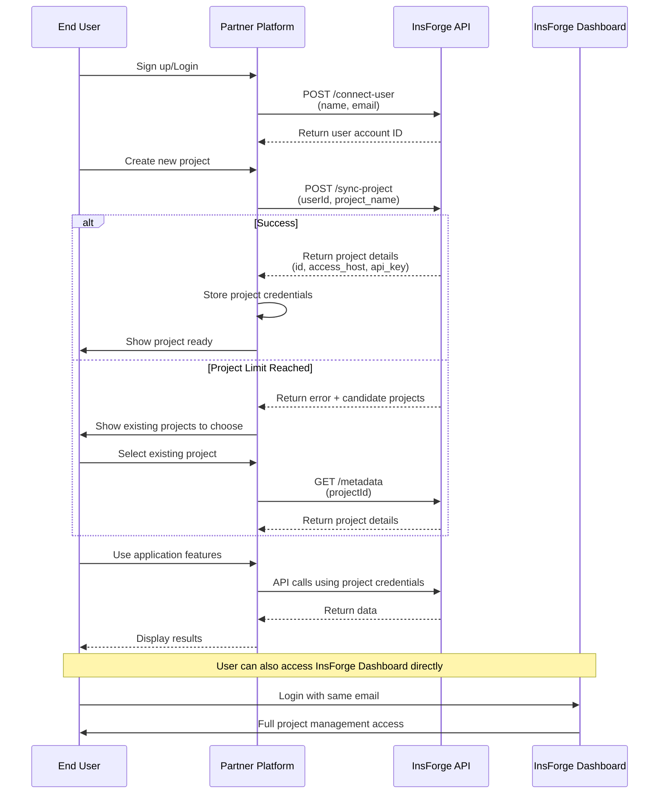
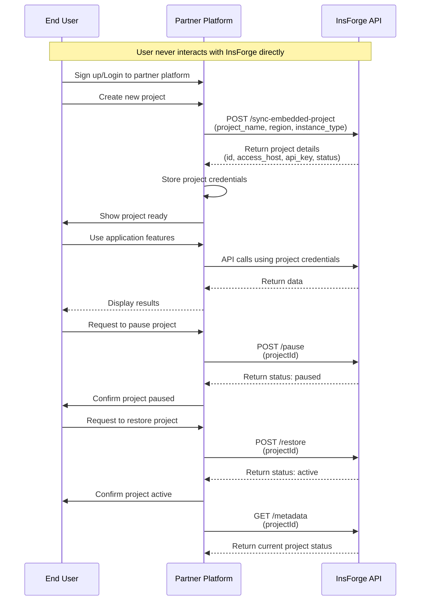

import { Steps, Card, CardGroup, Tabs, Tab } from '@mintlify/components';

## Overview

InsForge provides two partnership models that enable seamless integration of our Backend-as-a-Service platform into your applications. Whether you're looking for a co-branded solution or a fully white-labeled experience, we have the right partnership model for you.

## Partnership Models

<CardGroup cols={2}>
  <Card title="Co-Branded Partnership" icon="handshake">
    Perfect for platforms that want to offer InsForge alongside their services.
    The integration process is remarkably simple - developers can connect to the InsForge platform with just one click, without complicated OAuth flows.
  </Card>
  <Card title="White-Label Partnership" icon="tag">
    Ideal for platforms seeking complete control over the user experience.
    Offers full project lifecycle management, including project dashboard integration. Developers can complete all operations without ever leaving your partner platform.
  </Card>
</CardGroup>

## Partnership Benefits

<CardGroup cols={2}>
  <Card title="Scalable Infrastructure" icon="server">
    Leverage our robust backend infrastructure without the overhead of maintenance and scaling
  </Card>
  <Card title="Flexible Integration" icon="plug">
    Choose from multiple integration options that best suit your application needs
  </Card>
  <Card title="Revenue Sharing" icon="handshake">
    Benefit from our competitive revenue sharing model for partner applications
  </Card>
  <Card title="Technical Support" icon="headset">
    Get dedicated technical support and resources to ensure smooth integration
  </Card>
</CardGroup>

## Getting Started

<Steps>
  <Step title="Apply for Partnership">
    Submit your partnership application through our [partner email](mailto:partnerships@insforge.dev).
    Specify whether you're interested in co-branded or white-label partnership.
  </Step>

  <Step title="Receive Partner Credentials">
    Once approved, you'll receive:
    - **Partner ID**: Your unique partner identifier
    - **Secret Key**: Your authentication key for API access
    - Integration documentation and support
  </Step>

  <Step title="Configure Authentication">
    All API requests must include your secret key for authentication:

    ```bash
    curl -X POST https://api.insforge.dev/partnership/v1/YOUR_PARTNER_ID/endpoint \
      -H "Content-Type: application/json" \
      -H "X-Partnership-Secret: YOUR_SECRET_KEY"
    ```
  </Step>

  <Step title="Start Integration">
    Begin integrating based on your partnership model using our API endpoints.
  </Step>
</Steps>

## Features by Partnership Type

### Co-Branded Features
In co-branded mode, developers explicitly know they are InsForge platform users (linked through the same email address). After logging into the InsForge platform, developers have full management rights for projects created through partners and need to pay according to InsForge's billing plans.

Partner platforms can:
- ✅ Sync user accounts (name, email) with InsForge
- ✅ Sync projects to InsForge
- ✅ Query project connection information to leverage the completed backend capabilities.

### White-Label Features
In white-label mode, developers are not aware of InsForge's existence and cannot see partner-created projects on the InsForge platform.

Partner platforms can:
- ✅ Create embedded projects
- ✅ Query project metadata to leverage the completed backend capabilities.
- ✅ Pause projects
- ✅ Restore projects

## API Reference

<Tabs>
  <Tab title="Co-Branded APIs">

    ### Connect User Account
    Synchronize user account information with InsForge.

    ```bash
    POST /partnership/v1/:partnerId/connect-user
    ```

    **Request Body:**
    ```json
    {
      "name": "John Doe",      // required
      "email": "john@example.com" // required
    }
    ```

    **Response:**
    ```json
    {
      "account": {
        "id": "uuid-string"
      }
    }
    ```

    ### Sync Project
    Create or synchronize a project for a specific user.

    ```bash
    POST /partnership/v1/:partnerId/:userId/sync-project
    ```

    **Request Body:**
    ```json
    {
      "project_name": "my-project",  // required
      "region": "us-east",         // optional
      "instance_type": "nano"      // optional
    }
    ```

    **Response:**
    ```json
    {
      "success": true,
      "project": {
        "id": "uuid-string",
        "access_host": "https://project.us-east.insforge.app",
        "api_key": "project-api-key",
        "status": "active"
      }
    }
    ```

    #### Handling Project Limits
    Note: Due to project limits on the InsForge free plan, project synchronization from partner platforms may fail. In such cases, the response will be:

    ```json
    {
      "success": false,
      "message": "Free plan allows up to 2 active projects. Please upgrade your plan to create more projects.",
      "candidate_projects": [
        {
          "id": "uuid-string",
          "access_host": "https://project2.us-east.insforge.app",
          "api_key": "project-api-key",
          "status": "active"
        }
      ]
    }
    ```

    Partners can guide users to select existing projects for connection rather than always creating new ones.

    ### Get Project Metadata
    Retrieve connection information for a specific project.

    ```bash
    GET /partnership/v1/:partnerId/:userId/:projectId/metadata
    ```

    **Response:**
    ```json
    {
      "project": {
        "id": "uuid-string",
        "access_host": "https://project.us-east.insforge.app",
        "api_key": "project-api-key",
        "status": "active"
      }
    }
    ```

  </Tab>
  <Tab title="White-Label APIs">

    ### Sync Embedded Project
    Create an embedded project for white-label partners.

    ```bash
    POST /partnership/v1/:partnerId/sync-embedded-project
    ```

    **Request Body:**
    ```json
    {
      "project_name": "embedded-project",  // required
      "region": "us-east",               // optional
      "instance_type": "nano"            // optional
    }
    ```

    **Response:**
    ```json
    {
      "success": true,
      "project": {
        "id": "uuid-string",
        "access_host": "https://project.us-east.insforge.app",
        "api_key": "project-api-key",
        "status": "active"
      }
    }
    ```

    ### Get Project Metadata
    Retrieve metadata for a specific project.

    ```bash
    GET /partnership/v1/:partnerId/:projectId/metadata
    ```

    **Response:**
    ```json
    {
      "project": {
        "id": "uuid-string",
        "access_host": "https://project.us-east.insforge.app",
        "api_key": "project-api-key",
        "status": "active"
      }
    }
    ```

    ### Pause Project
    Pause an active project to save resources.

    ```bash
    POST /partnership/v1/:partnerId/:projectId/pause
    ```

    **Request Body:**
    ```json
    {
      "wait_for_completion": true  // optional
    }
    ```

    **Response:**
    ```json
    {
      "project": {
        "id": "uuid-string",
        "status": "paused"
      }
    }
    ```

    ### Restore Project
    Restore a paused project back to active state.

    ```bash
    POST /partnership/v1/:partnerId/:projectId/restore
    ```

    **Request Body:**
    ```json
    {
      "wait_for_completion": true  // optional
    }
    ```

    **Response:**
    ```json
    {
      "project": {
        "id": "uuid-string",
        "status": "active"
      }
    }
    ```

  </Tab>
</Tabs>

## Integration Examples

### Co-Branded Integration Flow

The following sequence diagram illustrates the integration flow for co-branded partnerships:



```typescript
// 1. Connect user account
const connectUser = async (name: string, email: string) => {
  const response = await fetch(
    `https://api.insforge.dev/partnership/v1/${PARTNER_ID}/connect-user`,
    {
      method: 'POST',
      headers: {
        'X-Partnership-Secret': `${SECRET_KEY}`,
        'Content-Type': 'application/json'
      },
      body: JSON.stringify({ name, email })
    }
  );

  const { account } = await response.json();
  return account.id;
};

// 2. Create project for user
const createProject = async (userId: string, projectName: string) => {
  const response = await fetch(
    `https://api.insforge.dev/partnership/v1/${PARTNER_ID}/${userId}/sync-project`,
    {
      method: 'POST',
      headers: {
        'X-Partnership-Secret': `${SECRET_KEY}`,
        'Content-Type': 'application/json'
      },
      body: JSON.stringify({
        project_name: projectName,
        region: 'us-east',
        instance_type: 'nano'
      })
    }
  );

  const data = await response.json();
  if (data.success) {
    return data.project;
  }
  throw new Error(data.message);
};

// 3. Use project credentials
const useProject = async (project: any) => {
  // Connect to InsForge project using returned credentials
  const insForgeClient = new InsForgeClient({
    baseUrl: project.access_host,
    apiKey: project.api_key
  });

  // Now you can use all InsForge features
  await insForgeClient.database.query('SELECT * FROM users');
};
```

### White-Label Integration Flow

The following sequence diagram illustrates the integration flow for white-label partnerships:



```typescript
// 1. Create embedded project
const createEmbeddedProject = async (projectName: string) => {
  const response = await fetch(
    `https://api.insforge.dev/partnership/v1/${PARTNER_ID}/sync-embedded-project`,
    {
      method: 'POST',
      headers: {
        'X-Partnership-Secret': `${SECRET_KEY}`,
        'Content-Type': 'application/json'
      },
      body: JSON.stringify({
        project_name: projectName,
        region: 'eu-west',
        instance_type: 'small'
      })
    }
  );

  const data = await response.json();
  if (data.success) {
    return data.project;
  }
  throw new Error(data.message);
};

// 2. Manage project lifecycle
const pauseProject = async (projectId: string) => {
  const response = await fetch(
    `https://api.insforge.dev/partnership/v1/${PARTNER_ID}/${projectId}/pause`,
    {
      method: 'POST',
      headers: {
        'X-Partnership-Secret': `${SECRET_KEY}`,
        'Content-Type': 'application/json'
      },
      body: JSON.stringify({
        wait_for_completion: true
      })
    }
  );

  const { project } = await response.json();
  console.log(`Project ${project.id} status: ${project.status}`);
};

const restoreProject = async (projectId: string) => {
  const response = await fetch(
    `https://api.insforge.dev/partnership/v1/${PARTNER_ID}/${projectId}/restore`,
    {
      method: 'POST',
      headers: {
        'X-Partnership-Secret': `${SECRET_KEY}`,
        'Content-Type': 'application/json'
      },
      body: JSON.stringify({
        wait_for_completion: true
      })
    }
  );

  const { project } = await response.json();
  console.log(`Project ${project.id} status: ${project.status}`);
};
```

## Parameter and Response Reference

### Project Region Values
InsForge provides global deployment capabilities. Each project can be deployed to different regions:
- `us-east` - United States East Coast
- `us-west` - United States West Coast
- `ca-central` - Canada Central
- `eu-central` - Europe Central

Additional regions will be added based on demand.

### Project Instance Type Values
Based on your project's business requirements, InsForge offers the following resource types:
- `nano` - Minimal resources for development
- `small` - Light workloads
- `medium` - Standard applications
- `large` - Production workloads
- `xl` - High-performance applications
- `2xl` - Enterprise applications
- `4xl` - Large-scale operations
- `8xl` - Mission-critical systems
- `16xl` - Maximum performance

### Project Status Values

Projects can have the following status values:

- **active**: Project is running and accessible
- **paused**: Project is paused (white-label only)

## Error Handling

All API endpoints return consistent error responses:

```json
{
  "success": false,
  "message": "Detailed error message describing what went wrong"
}
```

Common error scenarios:
- Invalid authentication credentials
- Project not found
- Insufficient permissions for requested operation
- Invalid request parameters

## Next Steps

- Schedule a [technical review](https://calendly.com/tony-chang-insforge/45min) with our team